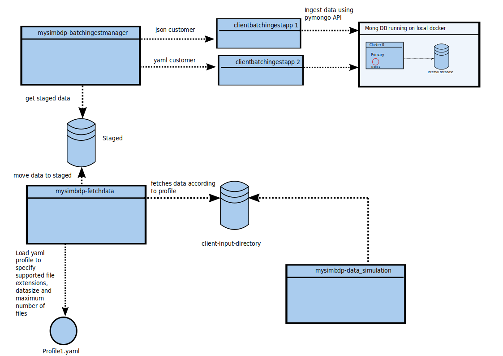
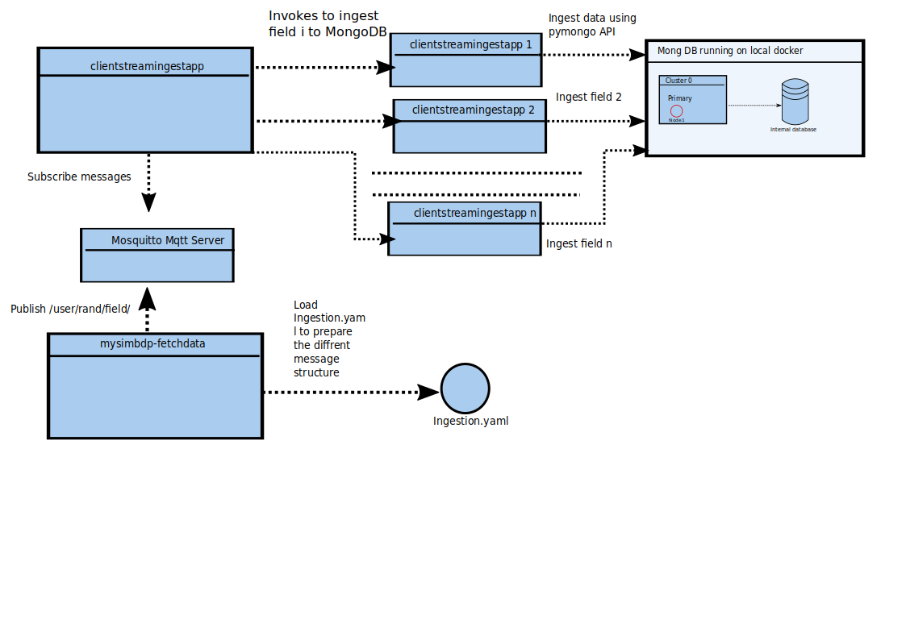

The test-results and a more detailed explaination can be found in the
Report.md.

Utilized API and components:
* Docker-compose: allows to scale  e.g. batchingester. and hence gives the opportunity
to run more  instances of an image without additional python programming
* MongoDB: is shema less database provider and I made in the the previous 
assignment alreadry some experience with it
* MQTT with Mosquitto: My first option was RabbitMQ, but since I had so much 
problems to connect my client to the service, I decided to switch to MQTT.
 

This is the utilized shema for Part 1 is the following one:

***The usgage of this shema is described in the Report.md***

This is the utilized shema for Part2:

***The usgage of this shema is described in the Report.md***