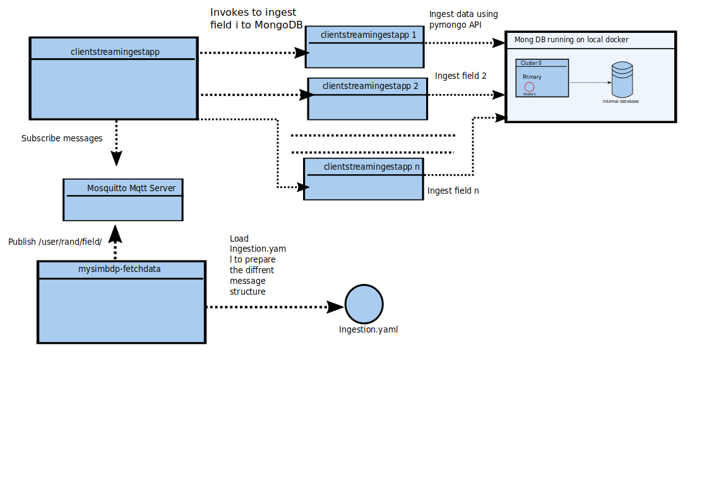

#  Report Second Assignment - Working on Data Ingestion Features

## Part 1

### 1.1)
To specify the constraints of the files, the following yaml profile was implemented:
profile.yaml:
:
```{yaml}
{
  max-size: 40000
  suportedformats:
    - "json"
    - "yaml"
    - "yml"
    - "txt"
}
```

In particular, this profile specifies four different customer preferences, where each customer ingests a different type of file.
The supported formats array represents all supported file extensions, the "
max-size" entry the max-size specifies the maximum file size in KB which is supported.

### 1.2)
The input-client-directory is mounted as a network volume. However, since
for this implementation are several tests required, an additional service
was implemented which creates during runtime some YAML and JSON files.
The fetch-data component has an observer using the python API watchdogs,
notifying the component if new components from the simulation have been created.
If such an event occurs, the fetch-data component checks whether the data
 fits the constraints defined in the above profile.yml and move it from the
*client-input-directory* to the network volume *staged*.
This service is running on its docker image.
### 1.3

The batching-ingest-manager runs also on it is on docker image and uses
the python API watchdogs to check whether new components are move in the stage directory.
The staging directory is a directory of the network volume *ingest:* which is mounted in the deployment.
Based on the type of file, the batch manager invokes the YAML- clientbatchingapp
or the JSON-batchingapp.

### 1.4

There is also  a performance log for each customer available
which averages the result:
These log files are located in the network volume logs.

***json.log***
```{logs}
12:22:17,60 root INFO File ingestions: 234 , succeeded: 234, failures: 0
12:22:17,60 root INFO average rate in KB: 5275.993652443052
12:22:17,60 root INFO average rate in MB: 5.152337551213918
```
.... and also for the ***json-client***:

```{json}
12:23:02,244 root INFO File ingestions: 212 , succeeded: 212, failures: 0
12:23:02,244 root INFO average rate in KB: 5210.285615316823
12:23:02,244 root INFO average rate in MB: 5.088169546207835
```
### 1.5
These log files are located in the network volume logs.
For the YAML-client I get the following results:
According to a small outtake of the log, we can see that we have an ingestion ration of 10 MB/s.

***yaml_performmance.log***
```{logs}
11:08:14,609 root INFO Server ('database', 27017) added to topology 5dbac09e042b4006763660a2
11:08:14,621 root INFO Ingesting file /stage/data.10_31_2019_12:08:13.yml
11:08:14,623 root INFO Command insert with request id 1681692777 started on server ('database', 27017)
11:08:14,624 root INFO Command insert with request id 1681692777 on server ('database', 27017) succeeded in 627 microseconds
11:08:14,624 root INFO Successful ingestion
11:08:14,624 root INFO 10250.816306321176KB/s
11:08:14,624 root INFO Needed 0.0028891563415527344 seconds ingestion time for /stage/data.10_31_2019_12:08:13.yml of size 29.6162109375 KB\ MB 0.028922080993652344
11:08:14,624 root INFO 10.010562799141773MB/s
```
According to a small outtake of the log customer, the ingestion ratio of json-client is 7 MB/s.
*json performance.log*
```{logs}
11:30:10,723 root INFO Command insert with request id 628175011 on server ('database', 27017) succeeded in 1012 microseconds
11:30:10,723 root INFO Command insert with request id 628175011 on server ('database', 27017) succeeded in 1012 microseconds
11:30:10,723 root INFO Command insert with request id 628175011 on server ('database', 27017) succeeded in 1012 microseconds
11:30:10,723 root INFO Successful ingestion
11:30:10,723 root INFO 7349.050746890127KB/s
11:30:10,723 root INFO Needed 0.00458073616027832 seconds ingestion time for /stage/data.10_31_2019_12:30:09.json of size 33.6640625 KB\ MB 0.03287506103515625
11:30:10,723 root INFO 7.1768073700098896MB/s
```
# Part2



### 2.1
The message has the following structure: **/user/random_nuber/field_name/**:
* user: specifies the current user
*  random number prevents, that the user does not overwrite a topic if
 field and user are equal at the same time for two ingestions.
* field_name: specifies the field name of the data

### 2.2
I also tried Rabbit MQ, but since my python client pika has
 connections problems which haven't been solved even after 2 days workload I decided to switch the framework.
The framework MQTT with Mosquitto is in this assignment utilized and runs in it's on docker image. 
 This component serves as the mysimbdp-
data broker uses the message-structure as specified above. The component 
*/data/client/code/app.py* provides a service that invokes on-demand clientstreamingestapp
in 10 seconds duration. This component serves as the mysimbdp-streamingestmanage.
In particular, the clientstreamingestapp is subscribing the server if there is something new to ingest and the mentioned ***app.py***
publish new messages to the MQTT server.

### 2.3
The test data is sampled from the database.csv  in the component 
**/data/client/app.py** every 10 seconds and published to the MQTT server.
For each *field* in the sampled data, an MQTT publishes command is sent to the 
MQTT server. In the following, the client event handler listens to the port of the MQTT server
post and the ingestion is triggered. This means that several ingestions are running simultaneously.
The test log delivers the following performance:

```
17:34:09,284 root INFO messages proccessed, 185 success: 185, failures: 0, ingestion_rate: 50652.05167571616 byte/sec 
17:34:09,288 root INFO messages proccessed, 186 success: 186, failures: 0, ingestion_rate: 37774.78757763975 byte/sec 
17:34:19,695 root INFO messages proccessed, 187 success: 187, failures: 0, ingestion_rate: 39396.214041745734 byte/sec 
17:34:19,698 root INFO messages proccessed, 188 success: 188, failures: 0, ingestion_rate: 107057.60577308566 byte/sec 
17:34:19,701 root INFO messages proccessed, 189 success: 189, failures: 0, ingestion_rate: 52474.03623813632 byte/sec 
17:34:29,275 root INFO messages proccessed, 190 success: 190, failures: 0, ingestion_rate: 33406.590069479746 byte/sec 
17:34:29,279 root INFO messages proccessed, 191 success: 191, failures: 0, ingestion_rate: 49760.95208082306 byte/sec 
17:34:29,284 root INFO messages proccessed, 192 success: 192, failures: 0, ingestion_rate: 39275.045527930255 byte/sec 
17:34:39,263 root INFO messages proccessed, 193 success: 193, failures: 0, ingestion_rate: 45003.26180257511 byte/sec 
17:34:39,266 root INFO messages proccessed, 194 success: 194, failures: 0, ingestion_rate: 60513.9817612631 byte/sec 
17:34:39,270 root INFO messages proccessed, 195 success: 195, failures: 0, ingestion_rate: 44598.44145685651 byte/sec 
17:34:49,730 root INFO messages proccessed, 196 success: 196, failures: 0, ingestion_rate: 51060.17670682731 byte/sec 
17:34:49,773 root INFO messages proccessed, 197 success: 197, failures: 0, ingestion_rate: 131130.75033617212 byte/sec 
17:34:49,777 root INFO messages proccessed, 198 success: 198, failures: 0, ingestion_rate: 38741.315213929294 byte/se
```
***This is only an outtake of the log to represent the results which I am experiences on my machine.***
### 2.4
The report is scheduled every 5 seconds and is stored in the file 
log network volume in the file *report_batch_file.log*:
Determined performance:
```
17:44:09,16 root INFO Performance of client-streaming: Average_size: 87 bytes, average ingest time: 0.002537392097213915 seconds, ingestion_rate: 35922.863555818076 byte/secnumber _of_messages: 51
17:44:24,14 root INFO Performance of client-streaming: Average_size: 87 bytes, average ingest time: 0.0016860015460212258 seconds, ingestion_rate: 53678.20653133275 byte/secnumber _of_messages: 57
17:44:39,14 root INFO Performance of client-streaming: Average_size: 87 bytes, average ingest time: 0.005430924982681364 seconds, ingestion_rate: 13788.71100362757 byte/secnumber _of_messages: 60
17:44:54,15 root INFO Performance of client-streaming: Average_size: 87 bytes, average ingest time: 0.004215977901140453 seconds, ingestion_rate: 31560.6683964712 byte/secnumber _of_messages: 66
17:45:09,15 root INFO Performance of client-streaming: Average_size: 87 bytes, average ingest time: 0.002130213170488626 seconds, ingestion_rate: 49451.747933324295 byte/secnumber _of_messages: 69
17:45:24,15 root INFO Performance of client-streaming: Average_size: 87 bytes, average ingest time: 0.003031468993506704 seconds, ingestion_rate: 27575.33801858989 byte/secnumber _of_messages: 75
17:45:39,15 root INFO Performance of client-streaming: Average_size: 87 bytes, average ingest time: 0.005928155855099593 seconds, ingestion_rate: 30861.33694181326 byte/secnumber _of_messages: 78
17:45:54,15 root INFO Performance of client-streaming: Average_size: 87 bytes, average ingest time: 0.0026231389038848417 seconds, ingestion_rate: 34630.77232608902 byte/secnumber _of_messages: 84
```
***This is only an outtake of the log to represent the results which I am experiences on my machine.***
### 2.5
The created report of the previous task can be accessed from a different service by reading from the network volume the file.
In particular, this service just needs to consider the last line, since it represents the most recent average results.
However, since I have to learn all these new technologies and have different 5 assignments during the week, I was not able to implement more.


