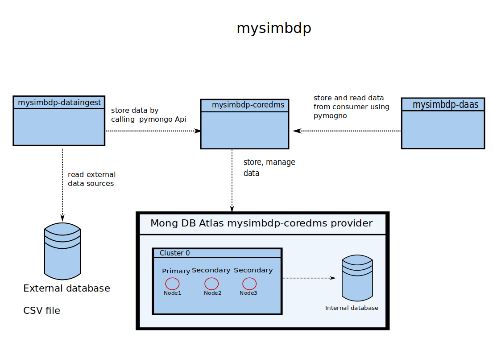

### 1.1)

There two implemented developed python script services that interact with the mysimbdp-coredms. The service mysimbdp-dataingest read the data from sources as CSV files and upload it in batches into the database using the mysimbdp-coredms. The mysimbdp-coredms service is hosted by MongoDB Atlas with three nodes and it manages and stores the data into the database.
The other service mysimbdb-daas is python service which stores and reads data from the database using the mysimbdp-coredms service. Both python script utilizing the API pymongo in order to interact with the mysimbdp-coredms.

### 1.2

The minimum requirement for a MongoDB cluster is to have at least two nodes: The first node represents a primary node where the second one represents a backup node. In the case that the primary node fails, the second node becomes the primary node. If a cluster has more than two nodes, an election takes place which chooses one of the available nodes to become the primary partition. This configuration provides a horizontally scalable and fault-tolerant deployment.

### 1.3

VM’s allocate in general more CPU and memory resources compared to the Docker technology. Moreover, the container is light-weighted in their snapshot size and can use shared labrys of the OS.
This allows multiple containers on the same operating system. Besides, containers are launching in milliseconds where virtual machines take in general some minutes to launch.
Hence, I will use the container from Docker.

### 1.4

As I already mentioned before, I chose MongoDB Atlas as my mysimbdp-coredms provider which offers me a cluster of three nodes. The first node serves as a primary node and will be replaced by one of the two other nodes if it fails.
The cluster is hosted by Google Platforms service and provides shared CPU and memory usages which will be dynamically allocated if the mysimbdp-coredms require it.
MongoDB provides the opportunity to scale vertically by buying another CPU and RAM or scaling horizontally by ordering resources. Further horizontally scaling can be achieved by adding additional servers to increase capacity as required.  These resources are completely sufficient for this use case since my bandwidth is the real bottleneck to the server.
### 1.5
Unfortunately, my computer does not have sufficient CPU, RAM and storage resources to host the platform on my machine. As I mentioned before, I chose MongoDB since it provides sufficient resources for this use case for free. Besides, it based on a schema-less table which reduces the complexity of the database. In particular, it allows the user to upload different documents of different sizes and the number of fields/columns in a single database.
