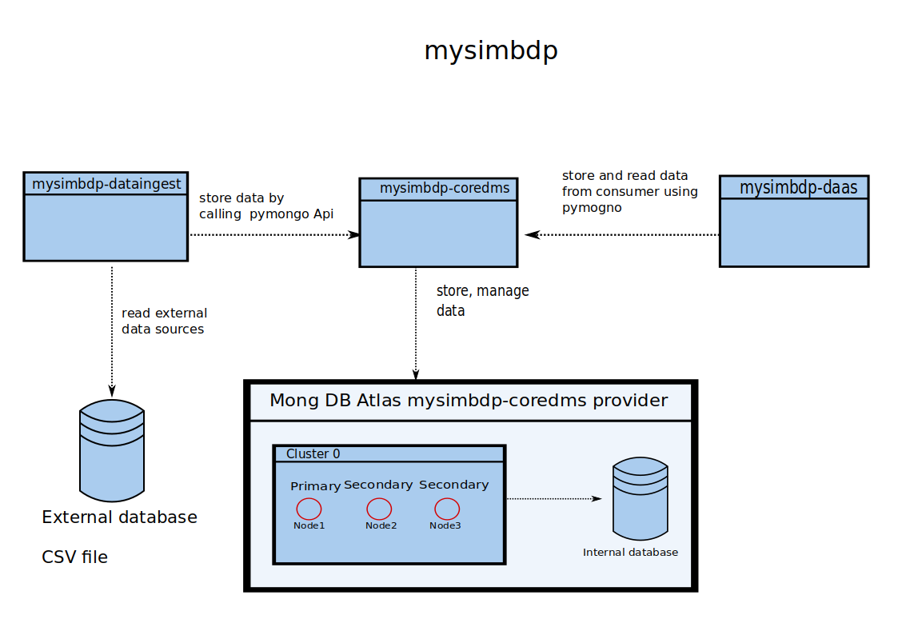

#  Report First Assignment - Building Your Big-Data Platforms

## Part 1

### 1.1)

There two implemented developed python script services that interact with the mysimbdp-coredms. The service mysimbdp-dataingest read the data from sources as CSV files and upload it in batches into the database using the mysimbdp-coredms. The mysimbdp-coredms service is hosted by MongoDB Atlas with three nodes and it manages and stores the data into the database.
The other service mysimbdb-daas is python service which stores and reads data from the database using the mysimbdp-coredms service. Both python script utilizing the API pymongo in order to interact with the mysimbdp-coredms.


### 1.2

The minimum requirement for a MongoDB cluster is to have at least two nodes: The first node represents a primary node where the second one represents a backup node. In the case that the primary node fails, the second node becomes the primary node. If a cluster has more than two nodes, an election takes place which chooses one of the available nodes to become the primary partition. This configuration provides a horizontally scalable and fault-tolerant deployment.

### 1.3

VM’s allocate in general more CPU and memory resources compared to the Docker technology. Moreover, the container is light-weighted in their snapshot size and can use shared labrys of the OS.
This allows multiple containers on the same operating system. Besides, containers are launching in milliseconds where virtual machines take in general some minutes to launch.
Hence, I will use the container from Docker.

### 1.4


As I already mentioned before, I chose MongoDB Atlas as my mysimbdp-coredms provider which offers me a cluster of three nodes. The first node serves as a primary node and will be replaced by one of the two other nodes if it fails.
The cluster is hosted by Google Platforms service and provides shared CPU and memory usages which will be dynamically allocated if the mysimbdp-coredms require it.
MongoDB provides the opportunity to scale vertically by buying another CPU and RAM or scaling horizontally by ordering resources. Further horizontally scaling can be achieved by adding additional servers to increase capacity as required.  These resources are completely sufficient for this use case since my bandwidth is the real bottleneck to the server.
### 1.5
Unfortunately, my computer does not have sufficient CPU, RAM and storage resources to host the platform on my machine. As I mentioned before, I chose MongoDB since it provides sufficient resources for this use case for free. Besides, it based on a schema-less table which reduces the complexity of the database. In particular, it allows the user to upload different documents of different sizes and the number of fields/columns in a single database.
## Part 2

### 2.1)

The design above represents the general structure of the MongoDB, embedding the data schema of the 2019.csv data set. Unlike a SQL-schema, each row is stored as a document with the corresponding fields/columns.
In our case the datasheet.
These are the following used in the MongoDB:

|object id | id |  Label | samplingPoint| notation| label| DateTime| determinand.label|
|---|---|---|---|---|---|---|---|

|determinand.definition | notation| resultQualifier.notation| result| interpretation|
---|---|---|---|---|

| determinand| dMaterialType| isCompliance| purpose.label| easting| northing|
---|---|---|---|---|---|


### 2.2)
The collections of MongoDB are partition by shared keys that define the size and range of a chunk. A chunk is a subset of the collection and its size is adjustable. In particular., the chunk size represents how many documents can be stored in one chunk. Small chunks provide a uniform distribution of the data and will require more frequent migrations. In contrast, large chunk sizes lead to more efficient network transportation of the data since fewer layers have to be queried but suffer by a uniform data distribution on the chunks.
Another perspective is that the chunks itself have to be split when the size gets exceeded or too many documents are inserted. A splitting operation is required to prevent the chunks from growing too large. The splitting operation split a chunk based on the shared key shard into smaller multiple chunks.
### 2.3)
I developed a python file called mysimbdp-dataingest.py and use a docker container environment to run the program.
The mysimbdp-dataingest.py  uses the pymongo API to initialize a client instance which creates a connection to my MongoDB Atlas account.
### 2.4)
To run the n of concurrent mysimbdp-dataingest.py, I added 5 scrips in the docker environment which invokes n times concurrent mysimbdp-dataingest for a different user.  
Each service upload then the sampled data from the 2019.csv into the MongoDB database.

One script example for invoking 10 concurrent services in the docker environment.
```bash
#!/bin/bash


echo "Simulating concurrent 10 diffrent user dataingest invokation"
# Start the first process
python ./mysimbdp-dataingest.py -user="new_user_1"  -p="new_user_1" -samp=500000  -lp='log_concurrent_user_10' &

# Start the second process

python  ./mysimbdp-dataingest.py -user="new_user_2"  -p="new_user_2"  -samp=50000 -lp='log_concurrent_user_10' &

python  ./mysimbdp-dataingest.py -user="new_user_3"  -p="new_user_3"  -samp=50000 -lp='log_concurrent_user_10' &

python  ./mysimbdp-dataingest.py -user="new_user_4"  -p="new_user_4"  -samp=50000 -lp='log_concurrent_user_10' &

python  ./mysimbdp-dataingest.py -user="new_user_5"  -p="new_user_5"  -samp=50000 -lp='log_concurrent_user_10' &

python  ./mysimbdp-dataingest.py -user="new_user_6"  -p="new_user_6"  -samp=50000 -lp='log_concurrent_user_10' &

python  ./mysimbdp-dataingest.py -user="new_user_7"  -p="new_user_7"  -samp=50000 -lp='log_concurrent_user_10' &

python  ./mysimbdp-dataingest.py -user="new_user_8"  -p="new_user_8"  -samp=50000 -lp='log_concurrent_user_10' &

python  ./mysimbdp-dataingest.py -user="new_user_9"  -p="new_user_9"  -samp=50000 -lp='log_concurrent_user_10' &

python  ./mysimbdp-dataingest.py -user="new_user_10"  -p="new_user_10"  -samp=50000 -lp='log_concurrent_user_10'
```


To upload the 50000 documents, I used a batch size of 100.
This shows the log of a single batch including the success rate as well as the response time. The full log file can be found in the log directory.


#### n=1 simulate_user_uploads_1.sh
To upload the 50000 documents, I used a batch size of 100.
This shows the log of a single batch including the success rate as well as the response time. The full log file can be found in the log directory.

```
00:04:30,246 root INFO start insert 100 row and ollumns
00:04:30,253 root INFO Command insert with request id 2044897763 started on server ('cluster0-shard-00-00-ukbbs.gcp.mongodb.net', 27017)
00:04:30,253 root INFO Command insert with request id 2044897763 started on server ('cluster0-shard-00-00-ukbbs.gcp.mongodb.net', 27017)
00:04:30,313 root INFO Command insert with request id 2044897763 on server ('cluster0-shard-00-00-ukbbs.gcp.mongodb.net', 27017) succeeded in 62925 microseconds
00:04:30,313 root INFO Command insert with request id 2044897763 on server ('cluster0-shard-00-00-ukbbs.gcp.mongodb.net', 27017) succeeded in 62925 microseconds
00:04:30,313 root INFO succesfully inserted 100 rows and 17 collumns
00:04:30,313 root INFO response time 0.07 seconds ---
```
So the overall response time  and error rate is:

```
00:05:07,213 root INFO Overall success rate for : 100.0 %
00:05:07,213 root INFO Overall failure rate  for : 0.0 % for 50000 documents upload.
00:05:07,213 root INFO Overall response time : 34.56025314331055 seconds  for 50000 documents upload.
```
### n=2 simulate_user_uploads_2.sh

##### Log results new_user_1:
```
00:29:24,428 root INFO start insert 100 row and ollumns
00:29:24,431 root INFO Command insert with request id 1189641421 started on server ('cluster0-shard-00-00-ukbbs.gcp.mongodb.net', 27017)
00:29:24,431 root INFO Command insert with request id 1189641421 started on server ('cluster0-shard-00-00-ukbbs.gcp.mongodb.net', 27017)
00:29:24,488 root INFO Command insert with request id 1189641421 on server ('cluster0-shard-00-00-ukbbs.gcp.mongodb.net', 27017) succeeded in 57911 microseconds
00:29:24,488 root INFO Command insert with request id 1189641421 on server ('cluster0-shard-00-00-ukbbs.gcp.mongodb.net', 27017) succeeded in 57911 microseconds
00:29:24,488 root INFO succesfully inserted 100 rows and 17 collumns
00:29:24,488 root INFO response time 0.06 seconds ---
```

```
00:30:00,784 root INFO Overall success rate for : 100.0 %
00:30:00,784 root INFO Overall failure rate  for : 0.0 % for 50000 documents upload.
00:30:00,784 root INFO Overall response time : 33.978217124938965 seconds  for 50000 documents upload.

```

##### Log results new_user_2:
```
00:29:24,530 root INFO start insert 100 row and ollumns
00:29:24,534 root INFO Command insert with request id 1025202362 started on server ('cluster0-shard-00-00-ukbbs.gcp.mongodb.net', 27017)
00:29:24,534 root INFO Command insert with request id 1025202362 started on server ('cluster0-shard-00-00-ukbbs.gcp.mongodb.net', 27017)
00:29:24,590 root INFO Command insert with request id 1025202362 on server ('cluster0-shard-00-00-ukbbs.gcp.mongodb.net', 27017) succeeded in 57747 microseconds
00:29:24,590 root INFO Command insert with request id 1025202362 on server ('cluster0-shard-00-00-ukbbs.gcp.mongodb.net', 27017) succeeded in 57747 microseconds
00:29:24,590 root INFO succesfully inserted 100 rows and 17 collumns
```
So the overall response time  and error rate is:

```
00:30:00,974 root INFO Overall success rate for : 100.0 %
00:30:00,975 root INFO Overall failure rate  for : 0.0 % for 50000 documents upload.
00:30:00,975 root INFO Overall response time : 34.1162850856781 seconds  for 50000 documents upload.

```
#### n=5 simulate_user_uploads_5.sh
The response and success rate is for all user nearly identical, hence in the following test report is just a part from the log for one user reported.
#### Log results new_user_5:

```
20:02:23,153 root INFO start insert 100 row and ollumns
20:02:23,165 root INFO Command insert with request id 1276673168 started on server ('cluster0-shard-00-00-ukbbs.gcp.mongodb.net', 27017)
20:02:23,166 root INFO Command insert with request id 1276673168 started on server ('cluster0-shard-00-00-ukbbs.gcp.mongodb.net', 27017)
20:02:23,275 root INFO Command insert with request id 1276673168 on server ('cluster0-shard-00-00-ukbbs.gcp.mongodb.net', 27017) succeeded in 115296 microseconds
20:02:23,275 root INFO Command insert with request id 1276673168 on server ('cluster0-shard-00-00-ukbbs.gcp.mongodb.net', 27017) succeeded in 115296 microseconds
20:02:23,276 root INFO succesfully inserted 100 rows and 17 collumns
20:02:23,276 root INFO response time 0.12 seconds ---
```
So the overall response time  and error rate is:
```
20:02:23,276 root INFO Overall success rate for : 100.0 %
20:02:23,276 root INFO Overall failure rate  for : 0.0 % for 50000 documents upload.
20:02:23,277 root INFO Overall response time : 41.304049491882324 seconds  for 50000 documents upload.
```


#### n=10 simulate_user_uploads_10.sh


#### Log results new_user_5:


```
00:33:44,534 root INFO start insert 100 row and 17 collumns
00:33:44,541 root INFO Command insert with request id 1748349614 started on server ('cluster0-shard-00-00-ukbbs.gcp.mongodb.net', 27017)
00:33:44,541 root INFO Command insert with request id 1748349614 started on server ('cluster0-shard-00-00-ukbbs.gcp.mongodb.net', 27017)
00:33:44,661 root INFO Command insert with request id 1748349614 on server ('cluster0-shard-00-00-ukbbs.gcp.mongodb.net', 27017) succeeded in 122667 microseconds
00:33:44,661 root INFO Command insert with request id 1748349614 on server ('cluster0-shard-00-00-ukbbs.gcp.mongodb.net', 27017) succeeded in 122667 microseconds
00:33:44,661 root INFO succesfully inserted 100 rows and 17 collumns
00:33:44,662 root INFO response time 0.13 seconds ---
```
So the overall response time  and error rate is:
```
00:33:46,91 root INFO Overall success rate for : 100.0 %
00:33:46,91 root INFO Overall failure rate  for : 0.0 % for 50000 documents upload.
00:33:46,91 root INFO Overall response time : 70.22667384147644 seconds  for 50000 documents upload.
```
### 2.5)
I don't experience failures when pushing a lot of data as 50.000 documents with several users simultaneously.
The limiting factor in this task is the infrastructure of my test environment and not the mysimbdp since the RAM of my notebook was maximally exhausted when running the test for 10 users simultaneously. Additionally, the upload of the 10 concurrent users is limited to my bandwidth.
Comparing the results of all test as shown in the table illustrated below, the average time needed for uploading 50.0000 documents with concurrent N=10 and N=1 user differ by 35 seconds. This twice the time of the test for one user, but then the test last test uploads 10 times the amount of data.


| Test| Average batch success rate| Average batch response|  Average success| Average time|
---|---|---|---|---|
N=1 concurrent user|100%|0.07 sec|100%|34 sec|
N=2 concurrent user|100%|0.07 sec|100%|34 sec|
N=5 concurrent user|100%|0.12 sec|100%|41 sec|
N=10 concurrent user|100%|0.13 sec|100%|70 sec|

### My suggestion to improve the performance:
The first t

## Part 3


## Bonus
