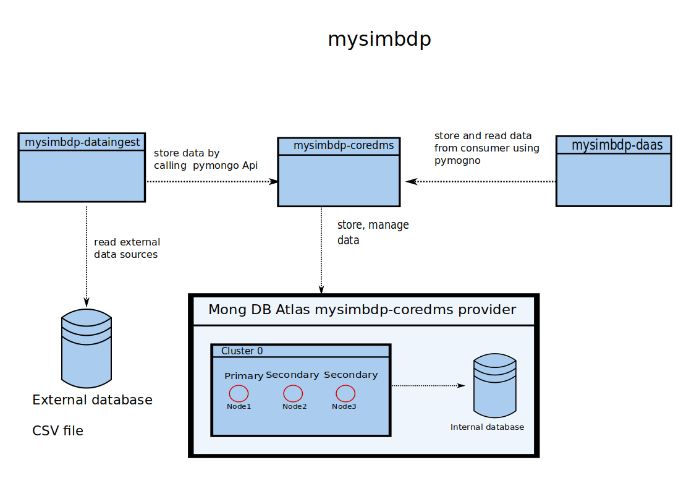
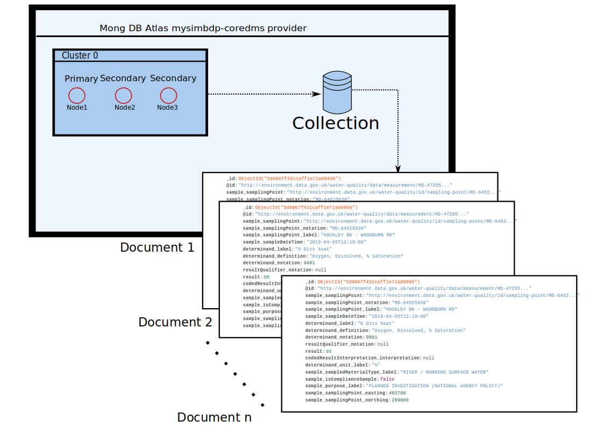
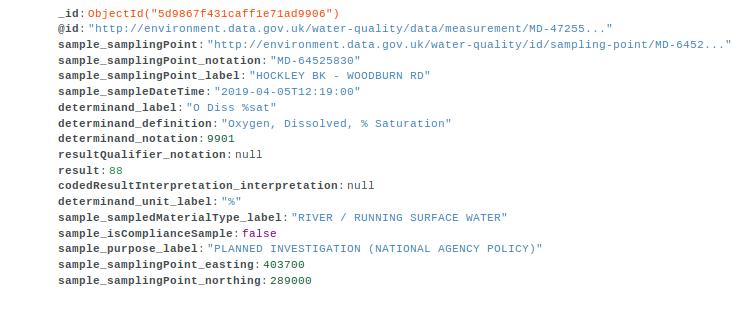

#  Report First Assignment - Building Your Big-Data Platforms

## Part 1

### 1.1)



### 1.2

The minimum requirement for a MongoDB cluster is to have at least two nodes: The first node represents a primary node where the second one represents a backup node. In the case that the primary node fails, the second node becomes the primary node. If a cluster has more than two nodes, an election takes place which chooses one of the available nodes to become the primary partition. This configuration provides a horizontally scalable and fault-tolerant deployment.

### 1.3

VM’s allocate in general more CPU and memory resources compared to the Docker technology. Moreover, the container is light-weighted in their snapshot size and can use shared labrys of the OS.
This allows multiple containers on the same operating system. Besides, containers are launching in milliseconds where virtual machines take in general some minutes to launch.
Hence, I will use the container from Docker.

### 1.4


As I already mentioned before, I chosed the MongoDB Atlas as my mysimbdp-coredms provider which offer me cluster of three nodes. The first node serves as a primary node and will be replaced by one of the two other node if it fails.
The cluster is hosted by Google Platforms service and provide shared CPU and memory usages which will be dynamically allocated if the mysimbdp-coredms require it.
MongoDB provide the opportunity to scale vertically by buying another CPU and RAM or scaling horizontally by ordering  resources. Further horizontally scaling can be achieved by adding additional servers to increase capacity as required.  These resources are completely sufficient for this use case, since my bandwidth is the real bottleneck to the server.
### 1.5
Unfortunately, my computer do not have sufficient CPU, RAM and storage resources to host an own plattform on my machine. As I mentioned before, I chosed MongoDB since it provide sufficient ressoureces for this use case for free. Besides, it based on a shema-less table shema which reduces the complexity of the database. In particular, it allows user to upload diffrent documents of different sizes and number of fields/collums in a single database.
## Part 2

### 2.1)

The design above represent the general structure of the MongoDB, embedding the data shema of the 2019.csv data set. Unlike a Sql-shema, each row is stored as a document with  the corresponding fiels/collumns.
In our case the datasheet.
These are the following used in the MongoDB:

|object id | id |  Label | samplingPoint| notation| label| DateTime| determinand.label|
|---|---|---|---|---|---|---|---|

|determinand.definition | notation| resultQualifier.notation| result| interpretation|
---|---|---|---|---|

| determinand| dMaterialType| isCompliance| purpose.label| easting| northing|
---|---|---|---|---|---|




### 2.2)
The collections of MongoDB are partition by shared keys that define the size and range of a chunk. A chunk is a subset of the collection and its size is adjustable. In particular., the chunk size represents how many documents can be stored in one chunk. Small chunks provide a uniform distribution of the data and will require more frequent migrations. In contrast, large chunk sizes lead to more efficient network transportation of the data since fewer layers have to be queried but suffer by a uniform data distribution on the chunks.
Another perspective is that the chunks itself have to be split when the size gets exceeded or too many documents are inserted. A splitting operation is required to prevent the chunks from growing too large. The splitting operation split a chunk based on the shared key shard into smaller multiple chunks.
### 2.3)
I developed a python file called mysimbdp-dataingest.py and use a docker containter environment to run the programm.
The mysimbdp-dataingest.py  uses the pymongo API to inialiaze a client instance which create a connection to my MongoDB Atlas account.
### 2.4)
In order to run the n of concurrent mysimbdp-dataingest.py, I added 5 scrips in the docker environment which invokes n times concurrent mysimbdp-dataingest for diffrent user.  
Each service upload then the sampled data from the 2019.csv into the MongoDB database.

One script example for invoking 10 concurrent services in the docker environment.
```bash
#!/bin/bash
echo "Simulating concurrent 10 diffrent user dataingest invokation"
# Start the first process
python ./mysimbdp-dataingest.py -user="new_user_1"  -p="new_user_1" -samp=500000 &

python  ./mysimbdp-dataingest.py -user="new_user_2"  -p="new_user_2"  -samp=50000 &

python  ./mysimbdp-dataingest.py -user="new_user_3"  -p="new_user_3"  -samp=50000 &

python  ./mysimbdp-dataingest.py -user="new_user_4"  -p="new_user_4"  -samp=50000 &

python  ./mysimbdp-dataingest.py -user="new_user_5"  -p="new_user_5"  -samp=50000 &

python  ./mysimbdp-dataingest.py -user="new_user_6"  -p="new_user_6"  -samp=50000 &

python  ./mysimbdp-dataingest.py -user="new_user_7"  -p="new_user_7"  -samp=50000 &

python  ./mysimbdp-dataingest.py -user="new_user_8"  -p="new_user_8"  -samp=50000 &

python  ./mysimbdp-dataingest.py -user="new_user_9"  -p="new_user_9"  -samp=50000 &

python  ./mysimbdp-dataingest.py -user="new_user_10"  -p="new_user_10"  -samp=50000
```
The output
* n=1 simulate_user_uploads_1.sh
* n=2 simulate_user_uploads_2.sh
* n=5 simulate_user_uploads_5.sh
* n=10 simulate_user_uploads_10.sh

### 2.5)

## Part 3


## Bonus
